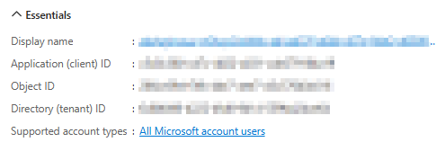
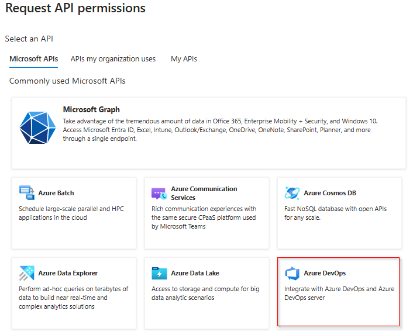

## Overview

Register Your Application in Azure AD

## 1. Register a New Application

- Sign in to the Azure Portal. Navigate to [Azure Portal](https://portal.azure.com).

- Go to **Azure Active Directory** > **App registrations** > **New registration**.
- Enter the following details:
  - **Name**: Enter a meaningful name for your app.
  - **Supported Account Types**: Choose an option based on your needs:
    - Single tenant: Accounts in your organization only.
    - Multi-tenant: Accounts in any organization's directory.
  - **Redirect URI**: This is not required for Device Code Flow but can be added later if needed.
- Click **Register**.

## 2. Copy the Application (Client) ID

- After registration, go to the **Overview** section.
- Copy the **Application (client) ID** and the **Directory (tenant) ID** and save it for later.

  

## 3. Configure API Permissions

- Navigate to **API Permissions** > **Add a permission**.

  - Select **Azure DevOps** or any other API you want to access.

    

## 4. Following are the scopes required

-   Following are the scopes required.
   
    | Scope                     | Description                              | 
    |---------------------------|------------------------------------------|
    | vso.agentpools            | Agent Pools (read)                       | 
    | vso.build_execute         | Build (read and execute)                 | 
    | vso.code_full             | Code (full)                              | 
    | vso.dashboards_manage     | Team dashboards (manage)                 | 
    | vso.extension_manage      | Extensions (read and manage)             | 
    | vso.profile               | User profile (read)                      | 
    | vso.project_manage        | Project and team (read, write and manage)| 
    | vso.release_manage        | Release (read, write, execute and manage)| 
    | vso.serviceendpoint_manage| Service Endpoints (read, query and manage)|
    | vso.test_write            | Test management (read and write)         | 
    | vso.variablegroups_write  | Variable Groups (read, create)           | 
    | vso.work_full             | Work items (full)                        | 