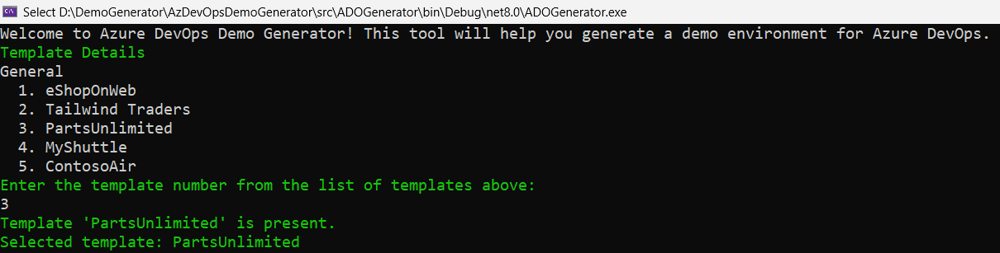
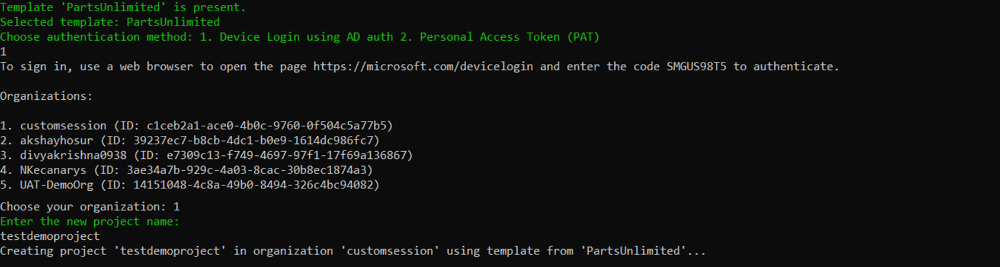
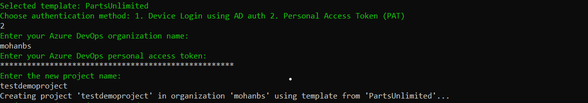

## Overview

Certain Azure DevOps labs require a preconfigured **Parts Unlimited** team project. This document outlines the required steps to set up the required data.

### Task 1: Configuring the Parts Unlimited team project

Keep Azure DevOps Demo Generator app ready. This app will automate the process of creating a new Azure DevOps project within your account that is prepopulated with content (work items, repos, etc.) required for the lab.For more information on the site, please see [https://docs.microsoft.com/en-us/azure/devops/demo-gen](https://docs.microsoft.com/en-us/azure/devops/demo-gen).

### 1. Select the project template

When you run the application you will see the information about predefined templates, choose the template by entering the corresponding number

### 2. Select the authentication method

Here you have 2 methods to authenticate Azure DevOps Demo Generator:

1. Device Login using AD authentication

   Register Your Application in Azure AD. Refer <a href="../appregister">Register and Setup</a>

   Login with the code displayed

   After the login, organizations will be listed and select organization to create project

   

2. With Personal Access Token (PAT)

   <a href="https://learn.microsoft.com/en-us/azure/devops/organizations/accounts/use-personal-access-tokens-to-authenticate?view=azure-devops&tabs=Windows#create-a-pat">Create Personal Access Token</a> with the given scopes below

   | Scope                      | Description                                |
   | -------------------------- | ------------------------------------------ |
   | vso.agentpools             | Agent Pools (read)                         |
   | vso.build_execute          | Build (read and execute)                   |
   | vso.code_full              | Code (full)                                |
   | vso.dashboards_manage      | Team dashboards (manage)                   |
   | vso.extension_manage       | Extensions (read and manage)               |
   | vso.profile                | User profile (read)                        |
   | vso.project_manage         | Project and team (read, write and manage)  |
   | vso.release_manage         | Release (read, write, execute and manage)  |
   | vso.serviceendpoint_manage | Service Endpoints (read, query and manage) |
   | vso.test_write             | Test management (read and write)           |
   | vso.variablegroups_write   | Variable Groups (read, create)             |
   | vso.work_full              | Work items (full)                          |

   Enter the organization name and the Personal Access Token (PAT). Provide the project name and press enter to create a project

   

### Task 2: Configuring the Parts Unlimited solution in Visual Studio

1. Some labs will require you to open the **Parts Unlimited** solution in **Visual Studio**. If your lab doesn't require this, you can skip this task.

1. Navigate to your Azure DevOps team project for **Parts Unlimited**. It will be something like [https://dev.azure.com/YOURACCOUNT/Parts%20Unlimited](https://dev.azure.com/YOURACCOUNT/Parts Unlimited).

1. Navigate to the **Repos** hub.

   

1. Click **Clone** and select **Clone in Visual Studio** (choose it in the dropdown if other option shown as default).
   
   

1. Follow the workflow to clone and configure the project in Visual Studio. Click **Clone** to copy the repo locally.

   

1. From **Team Explorer**, double-click **PartsUnlimited.sln** from the **Solutions** section to open the solution. You can ignore if you see any warnings about unsupported project types (just click OK on the prompted window and ignore the migration report opened on the browser)

   

   

1. Leave Visual Studio open for use in your lab.
